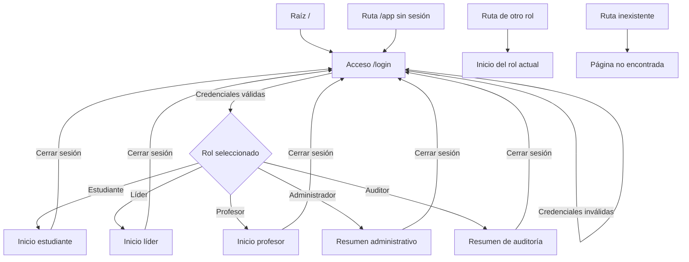
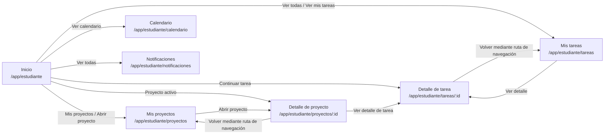
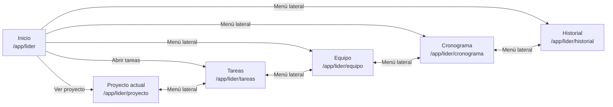
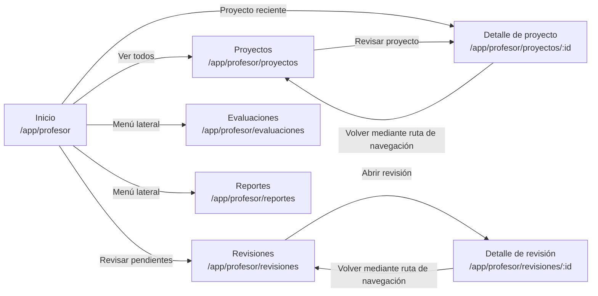
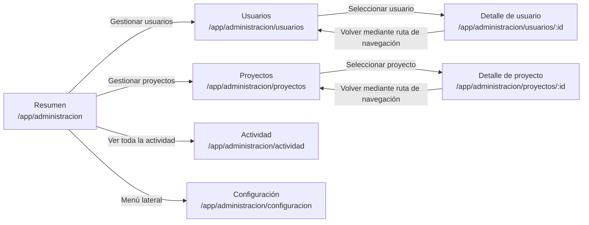
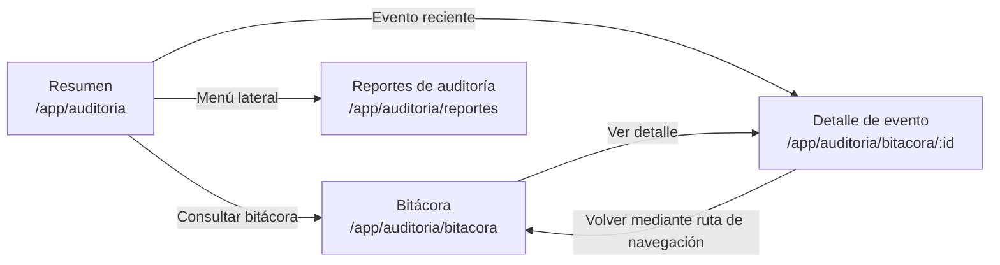

# Flujo de navegación entre pantallas

Este documento representa la navegación implementada en el mockup PGPTE. Los flujos se derivan de las rutas declaradas en `src/routes/AppRoutes.tsx`, del menú definido en `src/routes/navigation.tsx` y de los accesos directos disponibles en cada pantalla.

## Reglas generales de navegación

- La aplicación inicia en `/login`.
- Después de autenticar las credenciales de demostración, el sistema redirige a la pantalla inicial del rol seleccionado.
- Las rutas bajo `/app` requieren una sesión activa.
- Cada rol solo puede acceder a sus propias rutas. Un intento de acceso a otra sección redirige al inicio del rol actual.
- La barra lateral permite cambiar entre las pantallas principales autorizadas.
- La ruta de navegación superior permite regresar desde una pantalla de detalle a su listado.
- Cerrar sesión devuelve a `/login`.
- Una ruta inexistente muestra la pantalla **Página no encontrada**.

## Estudiante

## Líder de equipo

## Profesor

## Administrador

## Auditor

## Convenciones

| Elemento | Significado |
|---|---|
| Nodo | Pantalla o decisión de navegación |
| Flecha | Transición disponible para el usuario o redirección automática |
| `:id` | Segmento dinámico que identifica el registro seleccionado |
| Menú lateral | Acceso directo entre las pantallas principales del mismo rol |
